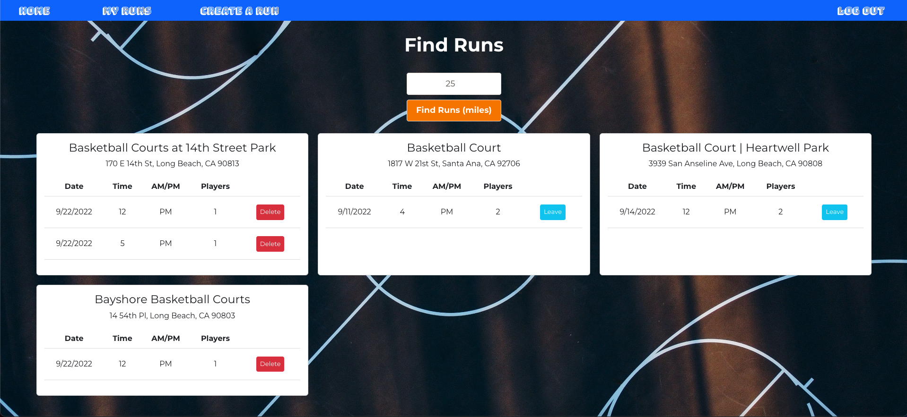

# HomeCourt
HomeCourt is an app for basektball fanatics looking to get extra practice time in. It allows users to search for nearby pickup games and join them. Users can also create their own games at basketball courts near them. 

# Screenshots
### Login

### Signup 

### Homepage

### My Runs

### Create Runs (Google Maps API)

# Technologies Used
- HTML
- CSS
- JavaScript
- Bootstrap
- MongoDB
- Express.js
- React.js
- Node.js
- Google Maps API
- Google Places Library
- Token Authentication

# Getting Started
[Click to use HomeCourt](https://homecourt.azurewebsites.net/)

# Next Steps
- Update styling to fit game cards on mobile
- Allow users to invite other users to their games
- Add a handleClick function for markers on the map to show more information about the location